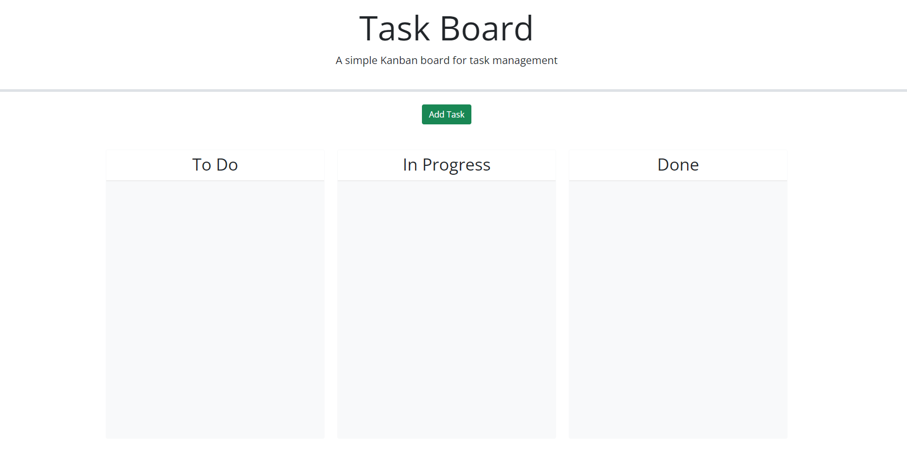
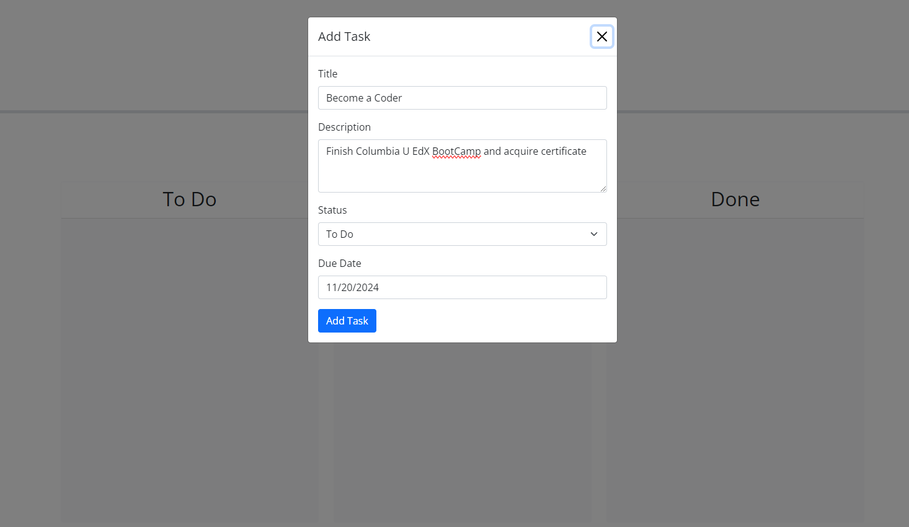
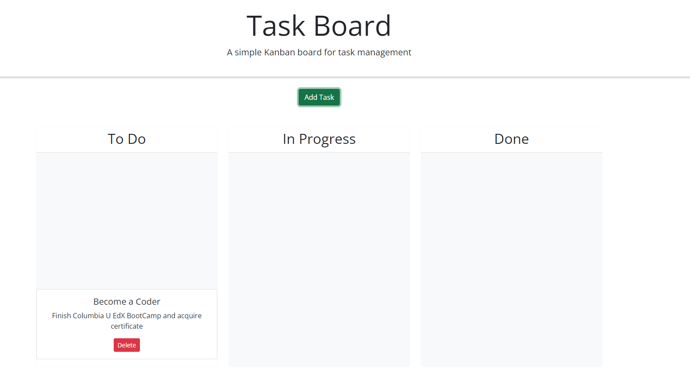
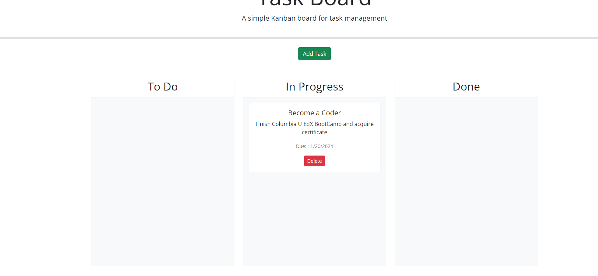

# Task Board Starter Code

## Overview

This project is a simple Kanban board for task management. It allows users to add, delete, and manage tasks. Tasks can be dragged and dropped between different status lanes: "To Do", "In Progress", and "Done". The tasks are stored persistently using `localStorage`.

## Features

- **Add Tasks**: Use a modal form to input task details including title, description, status, and due date.
- **Delete Tasks**: Remove tasks from the board.
- **Drag and Drop**: Move tasks between different status lanes.
- **Persistent Storage**: Tasks are saved in `localStorage` and retrieved when the page is reloaded.
- **Due Date Picker**: Select due dates using jQuery UI Datepicker.

## Screenshots

## How to Use

### Clone the Repository
To get started, clone this repository using the following command:

git clone git@github.com:MiguelPena0101/TASK-ORGANIZER.git

### Open in an IDE

1. Navigate to the cloned directory in your preferred IDE (Integrated Development Environment).
2. Open the project files to view and edit.

### Open in Browser

To view the Task Board in your web browser:

1. Open the `index.html` file in your web browser.

### Adding a Task

1. Click the "Add Task" button to open the modal form.
2. Fill in the task details (Title, Description, Status, Due Date).
3. Click "Add Task" to create the task.

### Moving a Task

Drag and drop tasks between lanes to update their status.

### Deleting a Task

Click the "Delete" button on a task card to remove it.

## Resources

This project was made possible with the help of various resources found throughout the web and websited referenced by Michael Filaramo who is leading the class

**Websites**: 
  - [Bootstrap Documentation](https://getbootstrap.com/docs/5.1/getting-started/introduction/)
  - [jQuery Documentation](https://api.jquery.com/)
  - [jQuery UI Documentation](https://jqueryui.com/)
  - [Day.js Documentation](https://day.js.org/)
  - [MDN Web Docs - Using localStorage](https://developer.mozilla.org/en-US/docs/Web/API/Window/localStorage)
  - [MDN Web Docs - HTML Drag and Drop API](https://developer.mozilla.org/en-US/docs/Web/API/HTML_Drag_and_Drop_API)